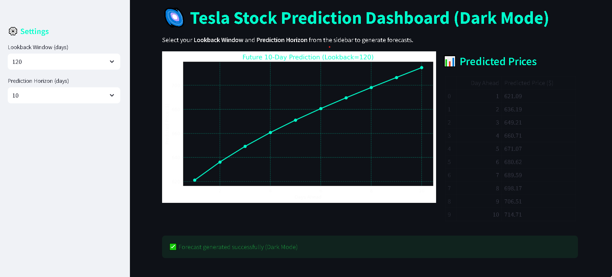

# 📈 Tesla Stock Prediction Dashboard

A professional Streamlit dashboard for predicting Tesla stock prices using **LSTM neural networks**.  
Supports multiple **lookback windows (30, 60, 90, 120 days)** and prediction horizons (**1, 5, 10 days**).  
Interactive charts + predicted price tables with **light & dark themes**.

---

## 🚀 Features
- Dynamic **Lookback Window** selection
- Prediction horizons: **1, 5, 10 days**
- Interactive charts with **matplotlib**
- Professional **UI design** (light & dark mode)
- Real‑time training & forecasting
- Recruiter‑friendly demo mode

---

## 🛠️ Tech Stack


---

## 📂 Project Structure

##tesla-stock-prediction/

│── app.py                 # Streamlit dashboard
│── data/TSLA.csv         # Tesla stock dataset
│── models/               # Saved models
│── requirements.txt       # Dependencies
│── README.md              # Documentation


---

## 📸 Screenshots

### Dashboard (Light Mode)


### Dashboard (Dark Mode)


---

## ⚙️ Installation

```bash
git clone https://github.com/<your-username>/tesla-stock-prediction.git
cd tesla-stock-prediction
python -m venv .venv
.venv\Scripts\activate
pip install -r requirements.txt
streamlit run app.py

## 👨‍💻 Author
Sayyed Mohsin Ali  
Intern Data Scientist 